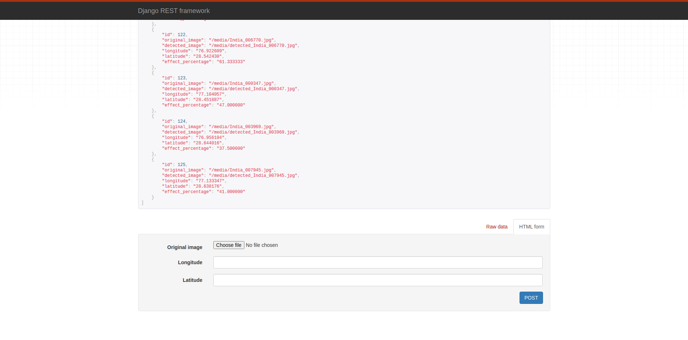

# Indian Road Safety

## Road Condition Analyser

### Install for Development

Run these commands in order:

```
virtualenv venv
source venv/bin/activate
pip install -r requirements.txt
cd webapp/
python manage.py migrate
python manage.py runserver
```

After this go to http://localhost:8000/ to see the running app in development.

To detect road damage use the api provided at this endpoint http://localhost:8000/api/road/

### Indian roads images dataset

- These images are provided in Dataset for GRDDC 2020 which consists of Indian road images.

Link to dataset (only images of India Roads): [Click Here](https://drive.google.com/drive/folders/1kol2Dwqqd7tsHijpp2YXIU1uJ100H0Ix?usp=sharing)

### Webisite Dashboard Screenshots


### API Screenshots





### Tech Stack

1. Tensorflow
2. Numpy
3. Open-CV
4. Django
5. Django Rest Framework
6. SQL
7. Google Maps API
8. DataSet is provided by GRDDC 2020

### REST API ROADS LIST SCREENSHOT


### Contributors

1. [Sankalp](https://github.com/codesankalp/)
2. [Aryaman](https://github.com/aryamanz29)
